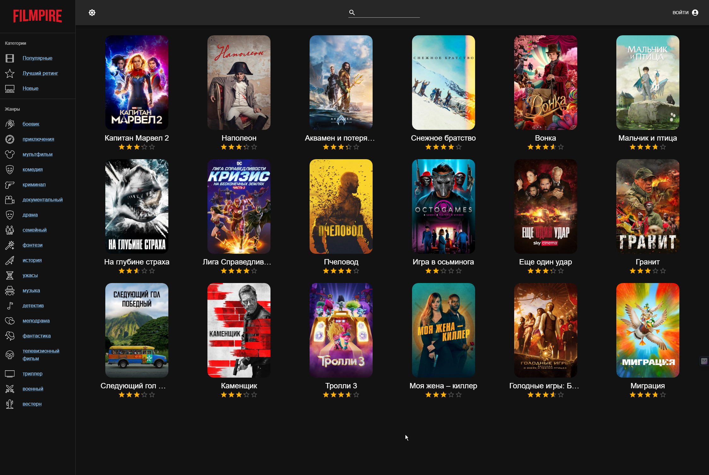
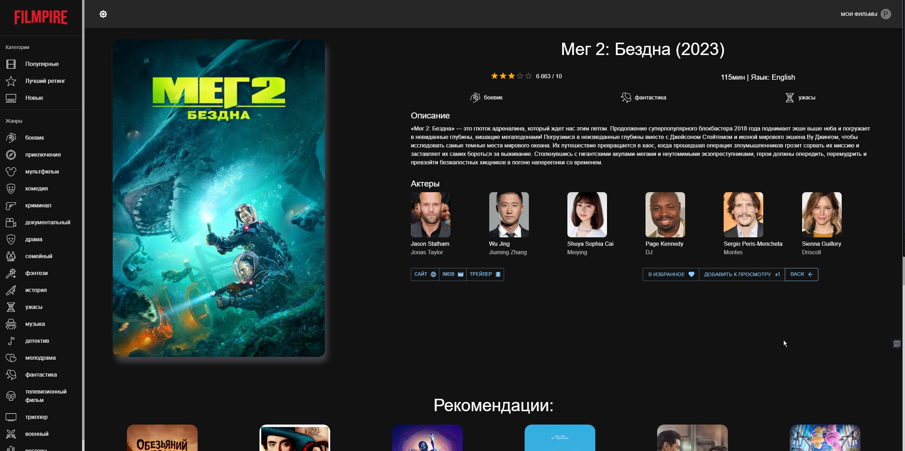
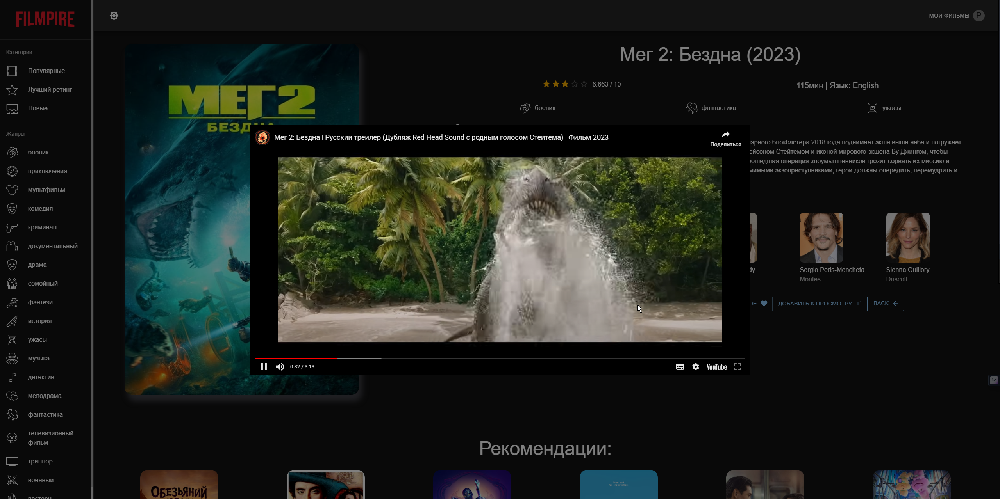
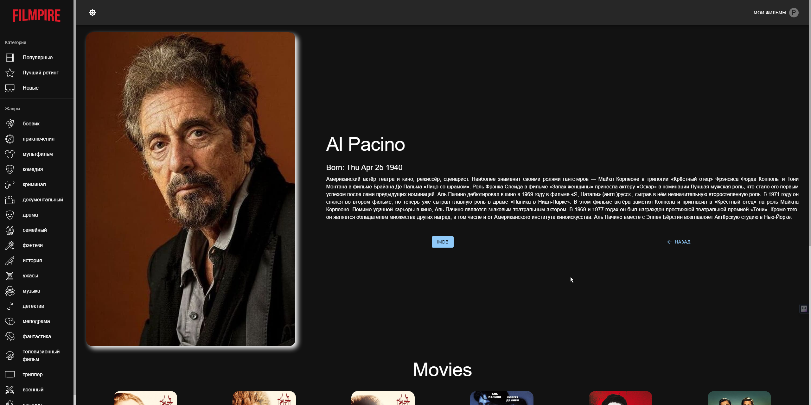
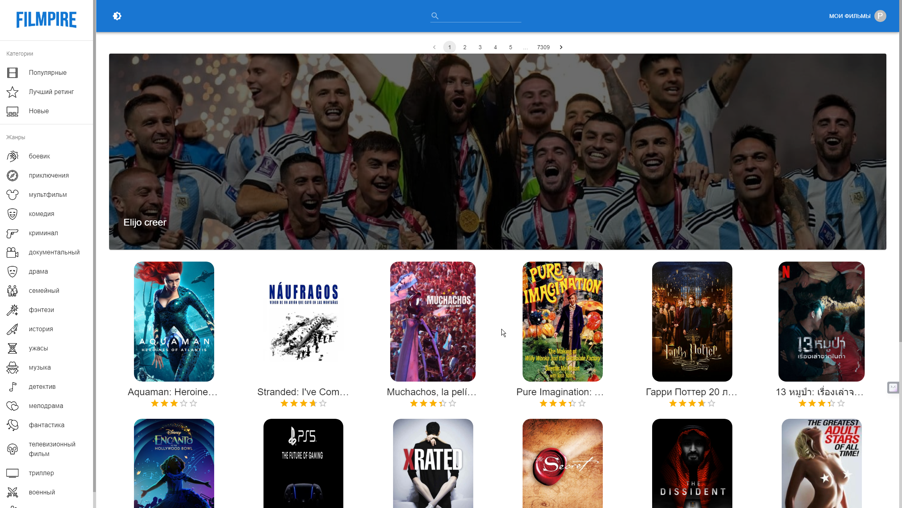
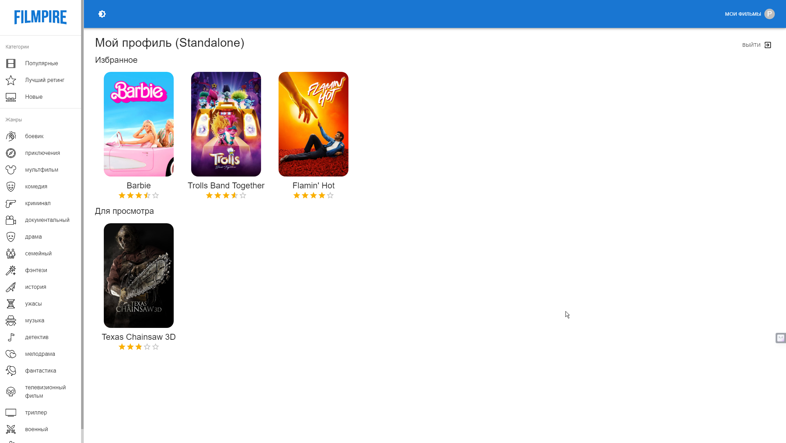

# React FILM APP

## Что использовалось при создании проекта:

* [ESLINT](https://eslint.org/docs/latest/use/getting-started)
* [REACT ROUTER](https://reactrouter.com/en/main/start/tutorial)
* [REDUX-TOOLKIT](https://redux-toolkit.js.org/api/createslice)
* [MATERIAL UI - MUI](https://mui.com/material-ui/all-components/)
* [MATERIAL ICONS - MUI](https://mui.com/material-ui/material-icons/)
* [THE MOVIE DB API](https://api.themoviedb.org/3)
 
